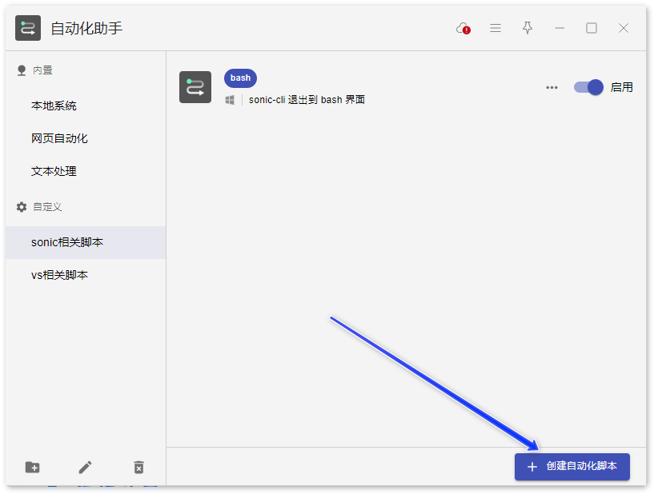
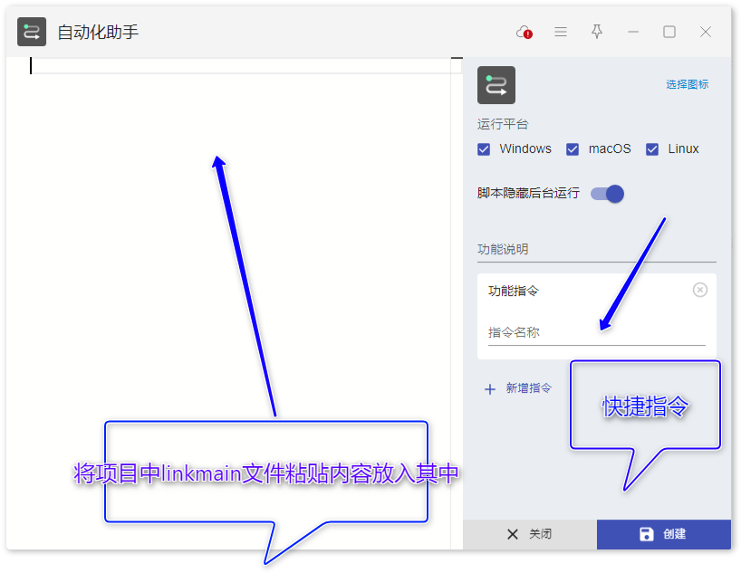

# Utools_script
收集一些常用的utools脚本要搭建 `linkMain.js`、`main.js`、`package-lock.json`和 `package.json`所在目录的 JavaScript 开发环境，可以按照以下步骤操作：

------

## **1. 确认 Node.js 环境**

确保已安装 Node.js（建议 LTS 版本）：

```
node -v  # 检查 Node.js 版本（建议 ≥ 16.x）
npm -v   # 检查 npm 版本
```

如果没有安装，去 Node.js 官网下载安装。

------

## **2. 安装依赖**

如果目录下有 `package.json`和 `package-lock.json`，直接运行：

```
npm install
```

这会根据 `package-lock.json`安装所有依赖。

------

## **3. 运行项目**

> 前置：需要安装 utools 工具，在里面下载 自动化助手插件



> 注意 linkmain 中的连接路径要和实际存放路径一致。
